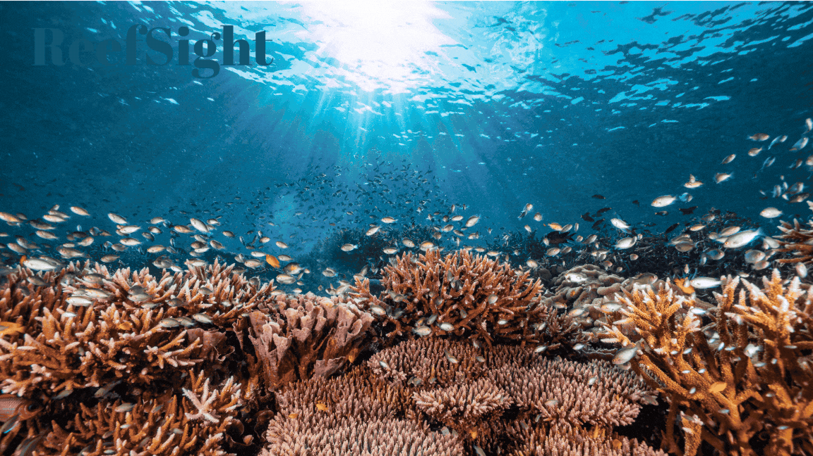

<div align="center">
  
</div>

<br />

# ReefSight

**🌊 Automatic Coral Health Insights Powered by AI**

Coral reefs support up to 25% of all marine species and are vital for biodiversity, fisheries, and coastal protection. Yet rising ocean temperatures are causing increasingly frequent and severe bleaching events — episodes where heat stress causes corals to expel the symbiotic algae they depend on, turning white and becoming vulnerable to death. Traditional reef monitoring is resource-intensive and geographically limited.

**ReefSight** is a multimodal deep learning application that predicts coral bleaching risk by combining high-resolution reef imagery and live environmental data. By leveraging computer vision, transfer learning, and structured environmental predictors fetched in real time from NOAA APIs, ReefSight offers a scalable, non-invasive approach to coral health monitoring — designed to support researchers and conservationists with faster, data-driven insights.

🔗 **[Try the live app](https://reefsight-front.streamlit.app)** — no installation required.

---

## 🧠 Prediction Modes

ReefSight supports two independent prediction modes:

**1. Image prediction**
Upload an underwater reef photo. A VGG16-based transfer learning model classifies it as bleached or healthy, and a GradCAM heatmap highlights the image regions driving the prediction — making the model's decision interpretable and scientifically meaningful.

**2. Environmental data prediction**
Provide a location (lat/lon) and observation date. ReefSight automatically fetches and derives a full set of environmental predictors from NOAA data sources (sea surface temperature, turbidity, wind speed, cyclone frequency, depth, distance to shore, and more), then runs a trained Random Forest classifier to predict bleaching risk.

Users who prefer to supply their own environmental measurements can bypass the auto-fetch pipeline and enter values manually.

> A multimodal fusion mode combining both inputs is currently under development.

---

## 🏗️ Architecture

```
Streamlit Frontend (app-copy.py)
        ↓ HTTP POST
FastAPI Backend (api/fast.py)        ← deployed on Google Cloud Run
        ↓
Image Pipeline              Tabular Pipeline
(VGG16 + GradCAM)          (NOAA fetch → preprocessing → Random Forest)
```

**Frontend**: Streamlit, hosted on Streamlit Cloud
**Backend API**: FastAPI, containerised with Docker, deployed on GCP Cloud Run
**ML logic**: `project_logic/`
**Model training & EDA**: `notebooks/`

---

## 📁 Repository Structure

```
08-ReefSight/
├── api/
│   ├── __init__.py
│   └── fast.py                  # FastAPI inference service
├── assets/                      # Banner and static assets
├── notebooks/                   # Model training, EDA, experiments
├── project_logic/
│   ├── __init__.py
│   ├── gshhg-shp-2.3.7/        # GSHHG shoreline dataset (bundled)
│   ├── ibtracs/                 # IBTrACS cyclone data (local only, see Setup)
│   ├── predict.py               # Image & tabular prediction logic + GradCAM
│   ├── preprocessing.py         # Image preprocessing & Pydantic input schemas
│   ├── tabular_fetch.py         # Live NOAA environmental data enrichment
│   └── tabular_preproc.py       # Feature engineering & preprocessing pipeline
├── models/                      # Trained model files (local only, see Setup)
├── scripts/
├── .gitignore
├── .python-version
├── Dockerfile
├── download_data.py             # One-time data download script (see Setup)
├── Makefile                     # Dev & deployment commands
├── README.md
├── requirements.txt
├── requirements_dev.txt
└── setup.py
```

> `models/`, `project_logic/ibtracs/`, and environment files (`.env`, `.env.yaml`, `.envrc`) are not committed to the repository. See Setup below.

---

## 🖼️ Image Prediction Pipeline

Uploaded reef images (`.jpg`, `.png`, `.jpeg`) are passed through a VGG16 network fine-tuned for binary bleaching classification. In addition to the prediction and confidence scores, ReefSight generates a **GradCAM (Gradient-weighted Class Activation Map)** overlay — a heatmap that highlights which regions of the image most influenced the model's decision.

This explainability layer makes predictions interpretable for domain experts: a well-calibrated model should focus on coral tissue rather than background water or substrate.

**API endpoint**: `POST /predict/image`
**Input**: Image file
**Output**: Classification label, confidence scores, base64-encoded GradCAM overlay

Implemented in `project_logic/predict.py` (`predict_image()`, `compute_gradcam()`, `render_gradcam_overlay()`).

---

## 📊 Tabular Prediction Pipeline

### Live Environmental Data Fetching

When a user provides only latitude, longitude, and observation date, the pipeline automatically fetches and derives the following environmental features:

| Feature | Source | Notes |
|---|---|---|
| Sea Surface Temperature (SST) | NOAA Coral Reef Watch (ERDDAP) | With temporal & spatial fallback |
| SSTA, SSTA_DHW, TSA, TSA_DHW | NOAA Coral Reef Watch (ERDDAP) | Anomaly & degree heating week metrics |
| ClimSST | NOAA Coral Reef Watch (ERDDAP) | Climatological SST baseline |
| Turbidity (Kd490) | NOAA VIIRS monthly composites | 10-year mean over 100km buffer |
| Wind speed | NOAA Blended Winds Daily | Derived from u/v wind components |
| Cyclone frequency | IBTrACS v04r01 | Historical count, 1975–2025, 250km radius |
| Depth | OpenTopography bathymetry | |
| Distance to shore | GSHHG global shoreline dataset | |
| Reef exposure | GSHHG-derived classification | Sheltered / Exposed |

### Fallback Strategy

ERDDAP data retrieval uses a structured multi-level fallback to maximise data availability for any coordinate and date:

1. Exact match (requested time, lat, lon)
2. Temporal fallback (up to 7 days back)
3. Spatial fallback (nearest valid ERDDAP grid point within 50km)
4. Combined temporal + spatial fallback
5. 4D nearest neighbour (wider spatial and temporal bounds)

If a variable cannot be retrieved after all fallback levels, it is set to `NaN` and the prediction is still attempted with available features. The frontend surfaces which fallback strategy was used for each variable, and which variables could not be fetched.

### Feature Engineering

Before inference, features are processed through a `dill`-serialised `sklearn` pipeline:
- Cyclic encoding of month (sin/cos)
- Year normalisation
- Median imputation for missing values
- Robust scaling for numerical features
- One-hot encoding for categorical features (`Exposure`)

**API endpoint**: `POST /predict/tabular`
**Output**: Classification label, confidence scores, fetch errors, fallback sources

---

## 🔍 GradCAM — Model Explainability

GradCAM is implemented by splitting the VGG16 model graph at the `block5_conv3` layer to compute gradients of the predicted class score with respect to that layer's activations. The resulting heatmap is:

- Resized to match the input image (224×224)
- Blended with the original image using the INFERNO colormap
- Annotated with a colorbar legend (Bleached → Healthy)
- Returned as a base64-encoded PNG for direct rendering in the frontend

This approach provides local, pixel-level interpretability for each individual prediction.

---

## ⚠️ Known Limitations & Design Decisions

**Cyclone frequency is precomputed, not live-fetched**

The IBTrACS global cyclone database (~150MB CSV) is bundled with the Docker image rather than fetched at runtime. This was a deliberate decision: the IBTrACS dataset is queried by NOAA over a fixed historical window (1975–2025) to compute a static climatological feature — cyclone frequency is not time-specific in the way SST or turbidity are. Fetching this file live from NOAA servers at inference time consistently caused 10–13 minute delays due to bandwidth throttling of cloud provider IP ranges, making the feature unusable in production. The bundled CSV is refreshed at each new deployment via `download_data.py`. Users running locally should run this script once after cloning (see Setup).

**NOAA ERDDAP throttling from cloud IPs**

NOAA's ERDDAP servers rate-limit or block requests from cloud provider IP ranges (GCP, AWS, etc.) more aggressively than residential IPs. This means live environmental data fetches (SST, turbidity, windspeed) may be slower in production than locally. The structured fallback strategy mitigates data availability issues, but cannot fully compensate for server-side throttling.

**Models are trained independently**

Image and tabular models are trained on separate datasets and combined at the application level, not via a joint architecture. The multimodal fusion mode is under development.

**Predictions are for research and educational purposes**

ReefSight is not intended for operational reef management decisions. Model outputs reflect patterns in historical training data and should be interpreted accordingly.

---

## 🚀 Running Locally

### Prerequisites

- Python 3.10.6
- pip

### 1. Clone the repository

```bash
git clone https://github.com/Lucia-Cordero/ReefSight.git
cd ReefSight
```

### 2. Install dependencies

```bash
pip install -r requirements.txt
```

### 3. Download required data

The IBTrACS cyclone dataset is not committed to the repository (see Known Limitations above). Run the following once after cloning:

```bash
python download_data.py
```

This downloads the IBTrACS CSV (~150MB) to `project_logic/ibtracs/`.

### 4. Add model files

Place the following trained model files in the `models/` directory (not committed to the repository):

```
models/
├── VGG16_image_model.keras
├── RandomForestClassifier.dill
└── preproc.dill
```

### 5. Run the FastAPI backend

```bash
uvicorn api.fast:app --reload
```

API available at `http://localhost:8000`. Interactive docs at `http://localhost:8000/docs`.

### 6. Run the Streamlit frontend

The frontend lives in a separate repository:
👉 [https://github.com/Lucia-Cordero/ReefSight_front](https://github.com/Lucia-Cordero/ReefSight_front)

Point `API_URL` in `app-copy.py` to `http://localhost:8000` for local development.

---

## 🐳 Deployment

The backend is containerised with Docker and deployed on **Google Cloud Run**. Deployment is managed via `Makefile` targets.

### Build and test locally

```bash
docker build --tag=$GAR_IMAGE:dev .
docker run -it -e PORT=8000 -p 8000:8000 $GAR_IMAGE:dev
```

### Deploy to GCP Cloud Run

```bash
make docker_build    # builds with linux/amd64 platform tag for Cloud Run compatibility
make docker_push     # pushes to Google Artifact Registry
make docker_deploy   # deploys to Cloud Run
```

First-time setup (one-time only):
```bash
make docker_allow        # authenticate Docker with GAR
make docker_create_repo  # create the Artifact Registry repository
```

Deployment configuration (memory, region, environment variables) is managed via `.env.yaml` (not committed).

---

## 📊 Model Performance

### Image Model (VGG16)

- Architecture: VGG16 with transfer learning, fine-tuned for binary classification
- Task: Bleached vs healthy coral imagery
- VGG16 transfer learning showed notably improved generalisation over a CNN baseline, particularly on validation data

### Tabular Model (Random Forest)

- Input: Engineered environmental feature vectors (15 features post-encoding)
- Task: Binary bleaching risk classification
- Temperature-related variables and their variability metrics (SSTA, SSTA_DHW, TSA) were among the strongest predictors of bleaching risk

Full training details, metrics, and experiments are documented in `notebooks/`.

---

## 📚 Datasets

| Dataset | Source | Use |
|---|---|---|
| Bleached Corals Detection | [Kaggle](https://www.kaggle.com/datasets/sonainjamil/bleached-corals-detection) | Image model training |
| Coral Reef Global Bleaching | [Kaggle](https://www.kaggle.com/datasets/mehrdat/coral-reef-global-bleaching) | Tabular model training |
| NOAA Coral Reef Watch | ERDDAP API | Live SST & anomaly features |
| NOAA VIIRS | ERDDAP API | Live turbidity |
| NOAA Blended Winds | ERDDAP API | Live wind speed |
| IBTrACS v04r01 | NOAA NCEI | Cyclone frequency (bundled) |
| GSHHG v2.3.7 | NOAA | Shoreline distance & exposure |
| OpenTopography | API | Bathymetric depth |

---

## 📄 License

MIT License

---

## 🙌 Acknowledgements

- NOAA Coral Reef Watch
- IBTrACS — International Best Track Archive for Climate Stewardship
- GSHHG — Global Self-consistent, Hierarchical, High-resolution Geography Database
- Streamlit & FastAPI open-source communities

---

🌊 *ReefSight aims to make coral health monitoring more accessible, interpretable, and scalable through AI.*
